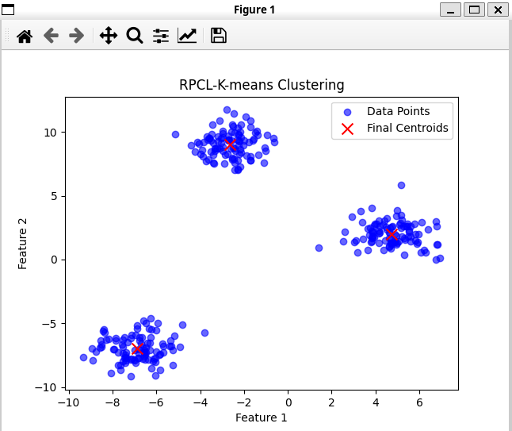
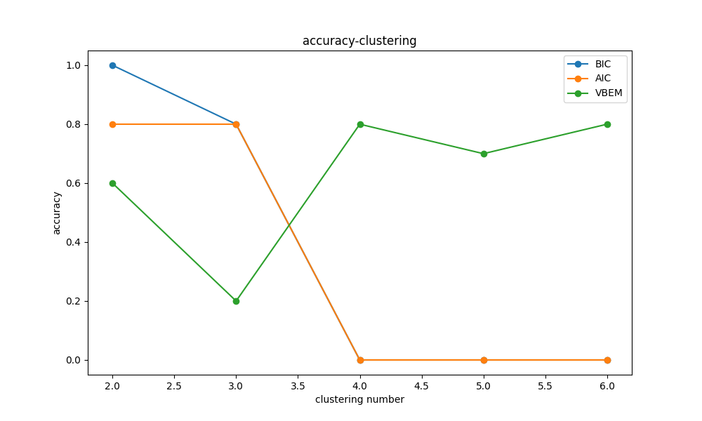
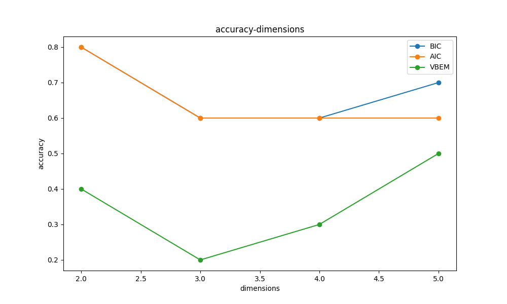
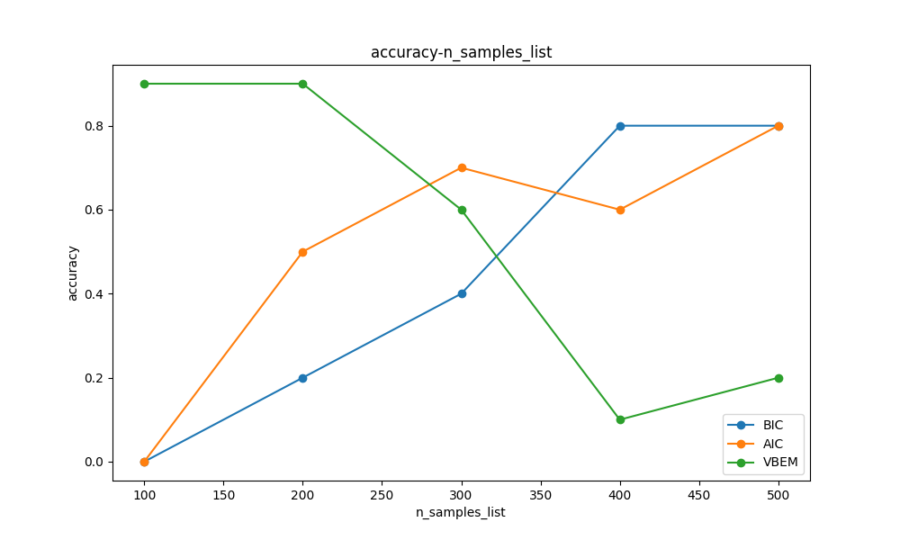

# homework1

## 1.1

### Assign point step

$$
\begin{aligned}
    J^{old}(u_{1},...,u_{K}) & = \sum_{t=1}^{N}\sum_{K=1}^{K}r_{tk}^{old}||x_t-u_{k}||^{2}\cr
    J^{new}(u_{1},...,u_{K}) & = \sum_{t=1}^{N}\sum_{K=1}^{K}r_{tk}^{new}||x_t-u_{k}||^{2}\cr
    J^{new}-J^{old} & = \sum_{r_{tk}^{new}\neq r_{tk}^{old}}(r_{tk}^{new}-r_{tk}^{old})||x_t-u_{k}||^{2}\cr
    & = \sum_{r_{ti}^{new}=1 \And\And r_{tj}^{old}=1} (||x_{t}-u_{i}||^2 - ||x_{t}-u_{j}||^2)\cr
    & \leq 0\cr
\end{aligned}
$$

The last step holds since $u_{k}$ is always assigned to its nearest clustering.

### Update $u_{k}$ step

$$
\begin{aligned}
    J^{old}(u_{1},...,u_{K}) & = \sum_{t=1}^{N}\sum_{K=1}^{K}r_{tk}||x_t-u_{k}^{old}||^{2}\cr
    J^{new}(u_{1},...,u_{K}) & = \sum_{t=1}^{N}\sum_{K=1}^{K}r_{tk}||x_t-u_{k}^{new}||^{2}\cr
    J^{new} - J^{old} & = \sum_{t=1}^{N}\sum_{K=1}^{K}r_{tk}(||x_t-u_{k}^{new}||^{2}-||x_t-u_{k}^{old}||^{2})\cr
    & = \sum_{K=1}^{K}(\sum_{t=1}^{N}r_{tk}(||x_t-u_{k}^{new}||^{2}-||x_t-u_{k}^{old}||^{2}))\cr
    \because & \sum_{t=1}^{N}r_{tk}(||x_t-u_{k}^{new}||^{2}-||x_t-u_{k}^{old}||^{2}) \leq 0\cr
    \therefore & J^{new} - J^{old} \leq 0
\end{aligned}
$$

In conclusion, each of the above two steps will never increase the k-mean objective function.

## 1.2

During **E** step, we can use hard division instead of soft assignment, that is $\gamma(z_{nk}) \in \lbrace 0,1 \rbrace$ and $\sum_{k=1}^{K}\gamma(z_{nk}) = 1$ or just use $z_{nk}$ to replace $\gamma(z_{nk})$. The pesudo code describes the algorithms.

```cpp
K-mean-GMM(X,k)
    Initialize old_pi,old_u,old_sigma as k-size array

    //E step
    Initialize Z as k*X.size() all 0 array
    for i = 0 to X.size()-1
        j = argmax([pi[i]*N(X[i]|u[m],sigma[m]) for m = 0 to k-1])
        Z[i][j] = 1
    //M step
    Initialize N as k-size all 0 array
    Initialize pi,u,sigma as k-size array
    For j = 0 to k-1
        u[j] = 1 / sum(Z[i][j] for i = 0 to X.size()) * sum(Z[i][j]*X[i] for i = 0 to X.size()) 
        sigma[j] = 1 / sum(Z[i][j] for i = 0 to X.size()) * sum(Z[i][j]* X[i]-u[j]*X[i]-u[j]^{T} for i = 0 to X.size())
        pi[j] = sum(Z[i][j] for i = 0 to X.size())/Z.size()

    //evaluate the log likehood
    P = sum(ln(sum(pi[k])N(X[n]|u[m],sigma[m])))

    if not convergent
        old_u = u
        old_sigma = sigma
        old_pi = pi
        return to E step
    else
        return
```

## 1.3

Yes, we can use RPCL to find the number of clustering before k-mean.

```py
#!/usr/bin/env python3
#- step1: Initialize $K$ clustering. Here, K should be a reasonably large value, larger than the expected number of clusters.
#- step2: run one time RPCL.Here, remove clustering with no elements
#- step3: reset assignment,run one time k-mean. Here, remove clustering with no elements
#- step4: If there are $u_{k}$ deleted, go to step2. If no $u_{k}$ deleted but $u_{k}$ update, go to step3. If none, return

# this algorithms sometime produce more than clustering
# sometime even just one clustering
import numpy as np
import matplotlib.pyplot as plt
from sklearn.datasets import make_blobs

# Generate synthetic dataset with three clusters
n_samples = 300
centers = 3
X, y = make_blobs(n_samples=n_samples, centers=centers, random_state=42, cluster_std=1.0)

# Parameters
initial_K = 10  # Start with more clusters than expected
learning_rate = 5.0*initial_K/n_samples  # Learning rate for the closest centroid
rival_penalty = 0.33*learning_rate  # Penalty rate for the second-closest centroid

# Initialize K centroids randomly from the data points
centroids = X[np.random.choice(range(X.shape[0]), initial_K, replace=False)]

def RPCL(X, centroids, learning_rate, rival_penalty):
    if len(centroids)==1:
        return centroids
    assignments = []
    centroids_copy = centroids.copy()  # Create a copy of centroids
    for x in X:
        distances = np.linalg.norm(x - centroids_copy, axis=1)
        closest, second_closest = np.argsort(distances)[:2]
        # Move closest centroid towards the point
        centroids_copy[closest] += learning_rate * (x - centroids_copy[closest])
        # Move the second closest centroid slightly away from the point
        centroids_copy[second_closest] -= rival_penalty * (x - centroids_copy[second_closest])
        assignments.append(closest)
    
    # Update centroids and remove clusters with no assigned points
    unique_assignments = set(assignments)
    new_centroids = []  # Initialize new centroids list
    for closest in unique_assignments:
        new_centroids.append(centroids_copy[closest])
    
    return np.array(new_centroids)

def assign_points(X, centroids):
    assignments = []
    for x in X:
        distances = np.linalg.norm(x - centroids, axis=1)
        closest = np.argmin(distances)
        assignments.append(closest)
    return assignments

def Kmean(X, centroids):
    # Recalculate centroids as the mean of assigned points, remove empty clusters
    assignments = assign_points(X, centroids)
    new_centroids = []
    for i in range(len(centroids)):
        points = [X[j] for j, closest in enumerate(assignments) if closest == i]
        if points:
            new_centroids.append(np.mean(points, axis=0))
    return np.array(new_centroids)

def rpcl_kmeans(X, centroids, learning_rate, rival_penalty):
    # Step 2: Run one-time RPCL update
    new_centroids = RPCL(X, centroids, learning_rate, rival_penalty)

    while True:
        #step 2 
        if len(new_centroids) < len(centroids):
            centroids = new_centroids
            new_centroids = RPCL(X, centroids, learning_rate, rival_penalty)
            continue
        # Step 3: Perform one-time K-means update on RPCL result
        centroids = new_centroids
        new_centroids = Kmean(X, centroids)
        
        # Step 4: Check for convergence
        if len(new_centroids) == len(centroids):# Check if centroids number
            if np.allclose(new_centroids, centroids):  # Check if centroids have stabilized
                return new_centroids  # Return final centroids


# Run the RPCL-K-means clustering
final_centroids = rpcl_kmeans(X, centroids, learning_rate, rival_penalty)

# Plot the results
plt.scatter(X[:, 0], X[:, 1], c='blue', label='Data Points', alpha=0.6)
plt.scatter(final_centroids[:, 0], final_centroids[:, 1], c='red', marker='x', s=100, label='Final Centroids')
plt.legend()
plt.xlabel('Feature 1')
plt.ylabel('Feature 2')
plt.title('RPCL-K-means Clustering')
plt.show()
```

I initialize 10 Cluterings. It sucessfully produces 3 cluterings.



## 1.4

### code

The python code below use dimensions as variable. It is easy to change it into using the clustering number or sample number as variable.

```py
import numpy as np
import matplotlib.pyplot as plt
from sklearn.mixture import GaussianMixture, BayesianGaussianMixture
from sklearn.model_selection import GridSearchCV


# 定义 BIC 和 AIC 评分函数
def gmm_bic_score(estimator, X):
    return -estimator.bic(X)


def gmm_aic_score(estimator, X):
    return -estimator.aic(X)


# 设置参数网格
param_grid = {
    "n_components": range(1, 7),
    "covariance_type": ["spherical", "tied", "diag", "full"],
}


# 实验次数
n_experiments = 10


# 簇数量
n_components = 3


# 样本数量
n_samples = 600


# 维度范围
dimensions_list = range(2, 6)


# 初始化准确度列表
bic_accuracy = np.zeros(len(dimensions_list))
aic_accuracy = np.zeros(len(dimensions_list))
vbem_accuracy = np.zeros(len(dimensions_list))

# 进行实验
for i, dimension in enumerate(dimensions_list):
    for _ in range(n_experiments):
        # 数据生成
        np.random.seed(_)
        C = np.random.rand(dimension, dimension)
        X = np.concatenate([np.dot(np.random.randn(n_samples, dimension), C) + np.array([2 * j] * dimension) for j in range(n_components)])


        # 使用 GridSearchCV 找到 BIC 和 AIC 最优模型
        bic_search = GridSearchCV(GaussianMixture(), param_grid=param_grid, scoring=gmm_bic_score)
        aic_search = GridSearchCV(GaussianMixture(), param_grid=param_grid, scoring=gmm_aic_score)
        bic_search.fit(X)
        aic_search.fit(X)


        # 获取 BIC 和 AIC 的最佳簇数
        bic_best_n_components = bic_search.best_params_["n_components"]
        aic_best_n_components = aic_search.best_params_["n_components"]


        # 使用 Variational Bayesian EM (VBEM) 自动确定簇的数量
        vbem_model = BayesianGaussianMixture(n_components=10, covariance_type='full', random_state=0)
        vbem_model.fit(X)
        vbem_n_components = np.sum(vbem_model.weights_ > 1e-2)  # 只考虑权重较大的簇


        # 统计准确度
        bic_accuracy[i] += np.abs(bic_best_n_components - n_components) < 1
        aic_accuracy[i] += np.abs(aic_best_n_components - n_components) < 1
        vbem_accuracy[i] += np.abs(vbem_n_components - n_components) < 1


# 计算平均准确度
bic_accuracy /= n_experiments
aic_accuracy /= n_experiments
vbem_accuracy /= n_experiments


# 绘制对比图
methods = ['BIC', 'AIC', 'VBEM']
accuracy_list = [bic_accuracy, aic_accuracy, vbem_accuracy]


plt.figure(figsize=(10, 6))
for i, (method, accuracy) in enumerate(zip(methods, accuracy_list)):
    plt.plot(dimensions_list, accuracy, label=method, marker='o')


plt.xlabel("dimensions")
plt.ylabel("accuracy")
plt.title("accuracy-dimensions")
plt.legend()
plt.show()
```

### range number of clusters



As shown in figure **cluster**, BIC and AIC perform good with small clustering number, while VBEM is the opposite. BIC perform better than AIC with small clutering numer.

### range dimensions



As shown in figure **dimension**, as dimensions increases, all three algorithms perform worse first, than return better.

### range sample size



As shown in figure **sample**, as sample size increase, BIC and AIC perform better and better, while VBEM perform worse.
